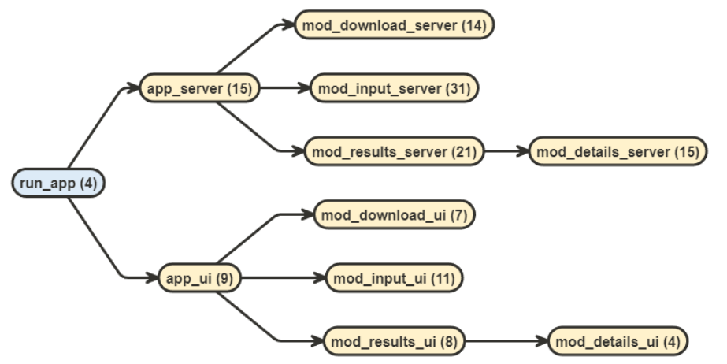
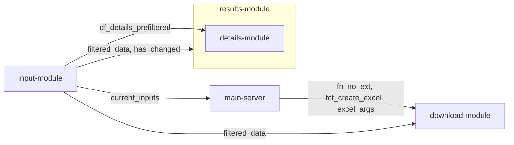

# Kandidierndenlisten Gemeinderatswahlen (KALI)
Shiny app for KALI Tool, created as a golem app

The KALI application on the [Website of Statistik Stadt Zürich](https://www.stadt-zuerich.ch/prd/de/index/statistik/themen/staat-recht-politik/politik/wahlen/gemeinderatswahlen/kandidierendenliste-gemeinderat.html) shows the results of all elections for the municipal council of Zurich since 2010.

The data is obtained from the Open Data portal of the city of Zurich and is available [here](https://data.stadt-zuerich.ch/dataset?q=Kandidierende&sort=score+desc%2C+date_last_modified+desc).

# Architektur

There are several modules:

- an **input module**, which contains all the input widgets, and returns data filtered according to those inputs, as well as some current inputs (the latter for properly naming the downloads)
- a **results module**, which takes the filtered data and shows a reactable
- a **details module**, which is nested within the results module, which shows the second table and the graph
  - this takes only static inputs, as it is only called when a row is clicked
  - it is only shown based on the row-click value with a conditional panel
- a **download module**
  - inputs for it come from the results module plus some (filename, excel arguments) are prepared in the main server
  - inputs are static
  - it also takes a function and an argument to it for the excel download

Different views on this architecture are shown below.

## flow diagram with flow package

## Module view

everything goes through the main server, but it is mentioned separately as some of the inputs for the download module are prepared there

