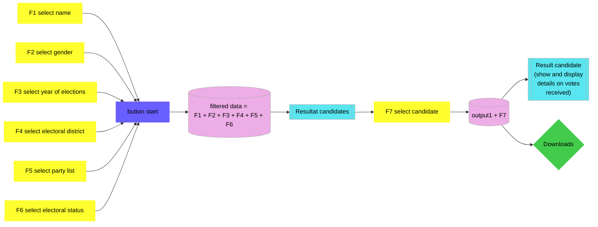

# Kandidierndenlisten Gemeinderatswahlen (KALI)
Shiny app for KALI Tool, created as a golem app

The KALI application on the [Website of Statistik Stadt Zürich](https://www.stadt-zuerich.ch/prd/de/index/statistik/themen/staat-recht-politik/politik/wahlen/gemeinderatswahlen/kandidierendenliste-gemeinderat.html) shows the results of all elections for the municipal council of Zurich since 2010.

The data is obtained from the Open Data portal of the city of Zurich and is available [here](https://data.stadt-zuerich.ch/dataset?q=Kandidierende&sort=score+desc%2C+date_last_modified+desc).

# Architektur

